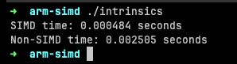

## ARM SIMD Overview on SIMD

This C program demonstrates the performance difference between SIMD (Single Instruction, Multiple Data) and non-SIMD 
computation by adding two large arrays of floating-point numbers. 

There are two key functions: `add_arrays_simd` and `add_arrays_no_simd`.The `add_arrays_simd` function uses the Accelerate
Framework provided by Apple, which employs SIMD operations to perform the addition. This function takes advantage of 
vectorized operations, allowing multiple data points to be processed simultaneously. The `add_arrays_no_simd` function,
on the other hand, uses a simple loop to add corresponding elements from the two arrays. This function processes each data
point individually.

The arrays are dynamically allocated on the heap using `malloc` due to their large size. The `get_time` function is used to capture 
the current system time in seconds. In the `main` function, two large arrays `a` and `b` are created and filled with numbers.

The program then times how long it takes to add these arrays together using both the SIMD and non-SIMD functions. The results are 
printed to the console to show the time difference between SIMD and non-SIMD operations. After the computations, 
the dynamically allocated arrays are freed from memory using `free`.

This program is a basic demonstration of how SIMD can significantly speed up computations by processing multiple data points 
simultaneously.

### References
- [arm-neon](https://developer.arm.com/architectures/instruction-sets/intrinsics/)
- [apple-dev-acceleerate](https://developer.apple.com/documentation/accelerate)
- [apple-dev-accelereate-vdsp_vadd]https://developer.apple.com/documentation/accelerate/1449798-vdsp_vadd
